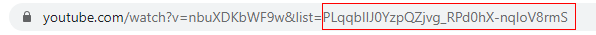

# YT-Playlist-Sorter
Sort any YouTube playlist based on selected attributes. Playlist does not have to necessarily be your own.

# Requirements
- Javascript must be enabled
- The playlist must be public

# Usage

1. Find the ID of the playlist you wish to sort on YouTube

> In this case, the ID would be **PLqqbIIJ0YzpQZjvg_RPd0hX-nqloV8rmS**

2. Click search

3. ???

4. Profit